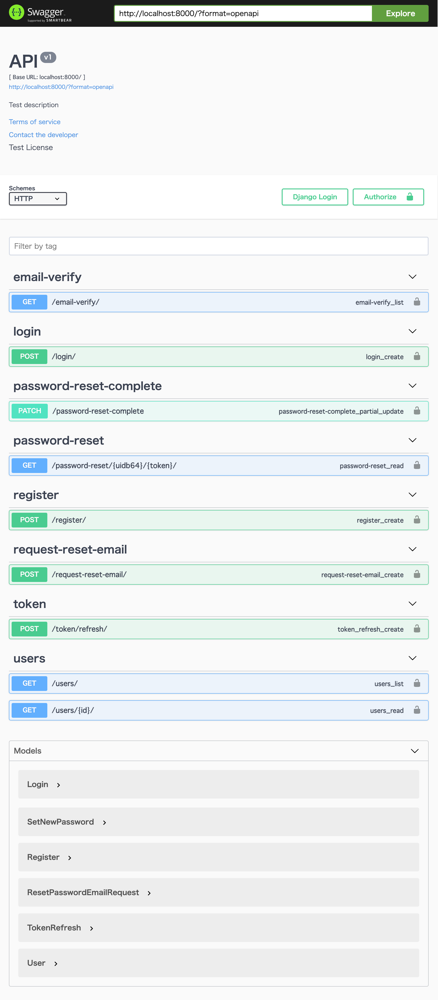

***機能一覧***

- make PostgreSQLを用いたDjangoサーバー起動
- make testでユニットテスト実行(github actionsでユニットテスト実行)
- localhost:8000にてswaggerでAPI一覧が見える
- メール認証、メールによるパスワードリセット

***swaggerでAPIをクリックしてTry it outで以下機能試せます。***

- /register/　email, username, passwordを入力 → jwt tokenを作成。登録メールアドレスに認証メールが届く。
- /email-verify/　認証メールに載っているAPI。tokenをdecodeしてそのユーザーのis_verifiedをTrueにする。
- /login/　メール認証後このAPIでログインできる。このレスポンスでrefresh tokenとaccess tokenを返す。
- /refresh/token/　ここにrefresh token(30days)を送れば、新しいaccess token(30min)を得られる。

- /request-reset-email/　パスワード変更したい時に最初に叩くAPI。メールが来る。(迷惑メールに来ることがある。)
- /password-reset/{uidb64}/{token}/　メールに載ってるAPI。idとtokenがOKかどうか。正しかったらidとtokenを返す。
- /password-reset-complete　ここにidとtoken、そして変更後のpasswordの値をPOST。これでリセット完了。

- /users/　ユーザー一覧取得
- /users/{id}/　ユーザー詳細

参考　https://www.youtube.com/watch?v=rJWAGQ0JxxI&t=223s

## step1: set mail
```
# backend
DEBUG=True
SECRET_KEY="django-insecure-=f88617ys7noel_p-h%v0dy-geg*eb5my#kg6bb+z+8$evmxuj"
EMAIL_HOST_USER=<GMAIL_ADDRESS>      # here
EMAIL_HOST_PASSWORD=<GMAIL_PASSWORD> # here

# postgres
POSTGRES_HOST_AUTH_METHOD=trust
POSTGRES_HOST=postgres
POSTGRES_DB=postgres
POSTGRES_PASSWORD=postgres
POSTGRES_USER=postgres
```
## step2: docker-compose
```
make
```
## step3: makemigrations and migrate
```
make migrate
```

http://localhost:8000
